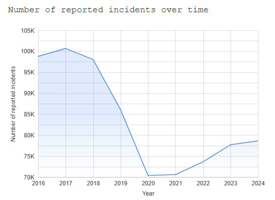

# Boston Crime Report


This repository is my final project for the **Data Engineering Zoomcamp 2025** that showcases an end-to-end pipeline for Boston crime data (2015–2025). Utilizing **Docker**, **dbt** and **Airflow** for orchestration, data is ingested into **BigQuery** and visualized through **Looker Studio**. The core dataset originates from [Boston’s open data portal](https://data.boston.gov/dataset/crime-incident-reports-august-2015-to-date-source-new-system), which includes crime incident reports spanning August 2015 to the present. By containerizing components and leveraging a modern analytics stack, this project illustrates best practices for scalable data engineering.

The final visualization can be viewed here: https://lookerstudio.google.com/reporting/80a53f8c-b344-4944-a023-0ad1bcbd6676 (up until April 15th 2025).

.jpg>)

## Table of Contents
1. [Data Source](#data-source)
3. [Project Structure](#project-structure)
4. [Setup & Installation](#setup--installation)
5. [Data Pipeline / Workflow](#data-pipeline--workflow)
6. [Analysis & Findings](#analysis--findings)
7. [How to Use / Run the Project](#how-to-use--run-the-project)
8. [Future Improvements](#future-improvements)
9. [License](#license)


---

## Data Source

This project integrates data from multiple files and references published on Boston’s official open data portal:

- **Crime Incidents (2015–2025)**  
  [Crime Incident Reports (August 2015–Present)](https://data.boston.gov/dataset/crime-incident-reports-august-2015-to-date-source-new-system)  
  These files are offered as annual CSVs (except 2023 file contains 2024 and 2025), each containing fields such as date/time, offense code, district, and location information. The same link also provides an Excel file for offense codes, mapping each code to its corresponding description and category.

- **District & Station Reference (CSV)**  
  [Boston Police Stations (BPD only)](https://data.boston.gov/dataset/8aa8671a-94fb-4bdd-9283-4a25d7d640cc/resource/c2b3f4c4-2339-4f14-9f44-86bee255e07d/download/boston_police_stations_bpd_only.csv)  
  Used for referencing district names and ensuring consistent identification across different records.
---

## Project Structure
Below is a summarized overview of the folder layout in this repository:
```
.
├── docker-compose.yml
├── Dockerfile
├── requirements.txt
├── airflow/
│   ├── dags/
│   │   ├── dbt_build_mart.py
│   │   ├── load_incidents.py
│   │   ├── load_offense_codes.py
│   │   └── load_police_districts.py
├── dbt/
│   ├── dbt_project.yml
│   ├── profiles.yml
│   ├── models/
│   │   ├── mart/
│   │   │   ├── district_dim.sql
│   │   │   ├── incident_fact.sql
│   │   │   └── vw_incident_district.sql
│   │   └── sources/
│   │       └── boston_crime.yml
```


- **airflow/**  
  Contains Airflow DAGs for scheduling and orchestrating the data pipeline.
- **dbt/**  
  Holds the dbt project configuration, profiles, and SQL models for data transformations. The models are run through Airflow.
- **docker-compose.yml**  
  Defines the Docker services (e.g., Airflow, PostgreSQL) used throughout the project.
- **Dockerfile** / **requirements.txt**  
  Used to build container images and specify required Python dependencies.


---

## Setup & Installation

### Prerequisites
- **Docker** and **Docker Compose** installed on your machine
- A **Google Cloud Platform** (GCP) account with permissions to:
  - Create and use Google Cloud Storage (GCS) buckets
  - Create and manage BigQuery datasets and tables

### Steps

1. **Clone the Repository**  
   ```bash
   git clone https://github.com/your-username/Boston-crime-report.git
   cd Boston-crime-report
   ```

 2. **Configure GCP Credentials**  
   - Place your GCP credentials JSON file in a secure location (e.g., `keys/creds.json`).  
   - Ensure your Docker containers can access these credentials. For example, set environment variables in a `.env` file or specify the path directly in your `docker-compose.yml`.

3. **Build & Start the Containers**  
   ```bash
   docker-compose up --build
   ```  
- This command spins up Airflow (webserver, scheduler) and any other services defined in docker-compose.yml.

4. **Access the Airflow UI**  
   - By default, the Airflow webserver runs at [http://localhost:8080](http://localhost:8080), unless otherwise configured in `docker-compose.yml`.  
   - Log in using the credentials specified in your environment or the Docker configuration.

5. **Trigger the DAGs in the Correct Order**  
   1. **`upload_to_gcs`** – Downloads data from the source websites and uploads it to Google Cloud Storage (GCS).  
   2. **`load_incidents`** – Loads the crime incident CSVs from GCS into BigQuery.  
   3. **`load_offense_codes`** – Converts Excel offense codes into CSV and loads them into BigQuery.  
   4. **`load_police_districts`** – Loads district reference CSV file into BigQuery.  
   5. **`dbt_build_mart`** – Executes dbt models to transform data into dimension/fact tables.

---

## Data Pipeline / Workflow

This project follows a structured sequence of steps to acquire, transform, and visualize Boston crime data:

1. **Download & Upload to Google Cloud Storage**  
   An Airflow job fetches the raw files (CSV/Excel) from the official Boston open data portal and uploads them into a designated GCS bucket.


2. **Load to Staging Tables**  
   Three separate Airflow tasks load the files from GCS into corresponding staging tables, ensuring each dataset (crime incidents, offense codes, and police districts) is properly structured in **BigQuery**.

.jpg>)

3. **Build Fact & Dimension Tables with dbt**  
   A final Airflow task invokes **dbt** to transform the staging tables into a dimensional model, creating fact and dimension tables—and a dedicated view for use in **Looker Studio**.


4. **Visualize in Looker Studio**  
   Once the data is processed and available in BigQuery, a Looker Studio report can be used to visualize the data.


---
## Visualization Exhibits

A complete visualization of the data is accessible in Looker; however, due to the project’s associated usage credits, it will be decommissioned on April 15, 2025.

At the top of the dashboard, two scorecards display the most recent date loaded and the total number of incidents recorded so far this year:


Because the dataset from Boston’s website is continually updated, rerunning the pipelines will refresh these figures with the latest data.

The **Number of Reported Incidents Over Time** chart shows the total number of incidents from 2016 to 2024 (only including years with complete data):



Next, a navigable map plots incidents throughout Boston using their latitude and longitude coordinates:


On the following page, there are three exhibits:

1. A table of the **Top 10 Offenses** in the dataset:

   

2. A pie chart illustrating the **Proportion of Crimes by Neighborhood**:

   

3. A pivot table listing selected offenses and their **Frequency by Neighborhood**:

   


---

## Future Improvements

- **Use the Boston Data API**  
  Transition from manual CSV/Excel ingestion to the official API for a more automated and real-time data flow.

- **Create a Dedicated Offense Description Dimension**  
  Currently, the focus is on districts and neighborhood names. Adding a standalone dimension for offense descriptions would enhance analytical capabilities.

- **Expand Visual Exhibits**  
  Incorporate additional charts, maps, and interactive filters for deeper insights.

- **Enrich Data Analysis**  
  Perform more detailed statistical or exploratory evaluations, identifying patterns or anomalies within the dataset.

- **Integrate Predictive Modeling**  
  Develop machine learning models to forecast crime likelihood or severity, providing proactive insights for stakeholders.


---

## Contact / Credits

- **Author**: Rafael Llopis Garijo (GitHub: [Rafiki00](https://github.com/Rafiki00))
- For feedback, suggestions, or contributions, please open an issue or submit a pull request in this repository.


